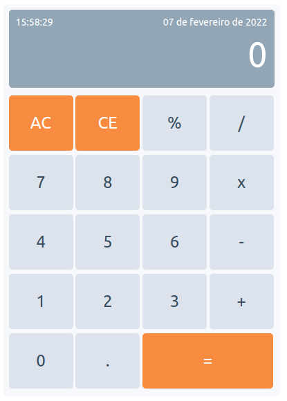

# Calculator Javascript

## Calculator features
* Calculator capable of performing basic operations such as addition, subtraction, division and percentage.
* It has audio functionality when double-clicking the AC button.
* It has updated date and time according to computer data.

   

